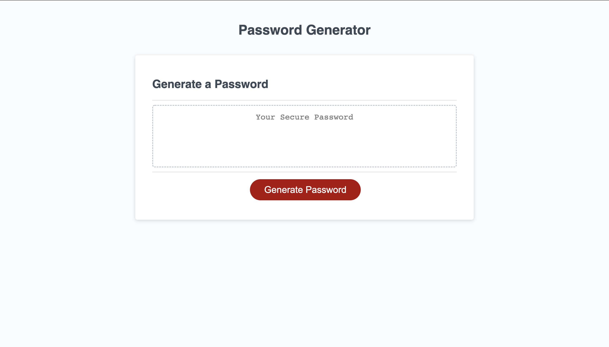

# Password Generator

## Description

- This project is meant to generate a random password based on criteria specified by the user.
- By generating a random password, it provides greater security.
- The user can choose the length of their password as well as whether or not their password will have uppercase letters, lowercase letters, numbers, and special characters.
- This project has helped me to learn the basics of JavaScript, like functions, objects, and scope!

## Installation

N/A

## Usage

Here is the link to the deployed website: https://francescortuna.github.io/password-generator/

Screenshots:

## Credits

N/A

## License

N/A